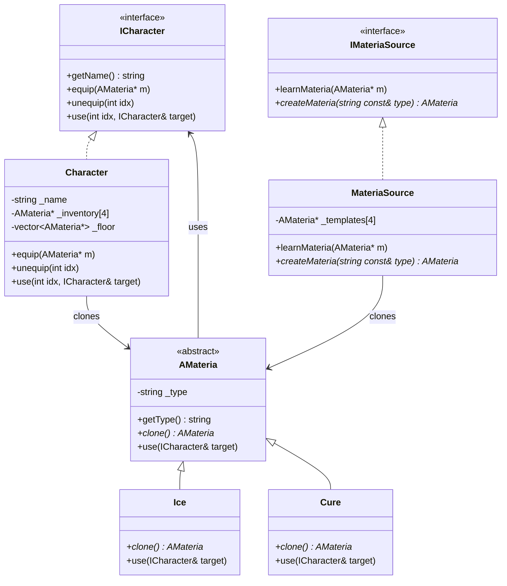

# 42-CPP_Module_04
42 Common Core CPP Module 02.  
- Object-Oriented Programming in C++
- Polymorphism
- Abstract classes
- Interfaces

- 
## Table of Contents
- 
- 
- 
- [More info](#more-info)

----------------------------------------

--> Buenas prácticas:
- En los métodos miembro/funciones usar referencias para evitar copias innecesarias
- Usar const siempre que no se vaya a tener que modificar las variables de turno, por buenas prácticas tb

---> cuándo tenemos que declarar un destructor como virtual?

--> cosas nuevas; std::copy de algorithm
--> std::array<std::string, 100>
--> clases no instanciables...  

### Polymorphism -> Deep copy
--> deep copy para que cada objeto de clase hija tenga su objeto Brain independiente?¡
- Shallow copy: only copies the pointers, not the content. Two different objects point to the same memory resource. Esto provoca problemas al liberar memoria (doble delete)

            this->_brain = other._brain;
  
- Deep copy: a new independent copy of the resource is created. Each object has its own memory.
  - En la inicialización:
  - 
           this->brain = new Brain(*other._brain)
  - En la copia:
    
            Cat&	Cat::operator=(const Cat& other)
            {
            	std::cout << GREEN << "Cat Assignment Operator called" 
            				<< RESET << std::endl;
            	if (this != &other)
            	{
            		Animal::operator=(other);
            		*this->_brain = *other._brain;
            	}
            	return (*this);
            } 

  -> esto es deep copy también?:
  
                          Character&	Character::operator=(const Character& other)
                        {
                        	//std::cout << "Character Assignment Operator called" << std::endl;
                        	if (this != &other)
                        	{
                        		this->_name = other._name;
                        		*this->_inventory = *other._inventory; //deep copy of inventory
                        	}
                        	return (*this);
                        }

### Clases abstractas

Las clases abstractas son clases que no pueden crearse directamente (no puedes hacer ***new*** de ellas). Solo sirven como clase base para otras clases.  
Cuando una clase tiene como mínimo un método virtual puro (=0) es una clase abstracta. Un método virtual puro se trata de una función que no es implementada por la clase base, que se instancia pero no se implementa, se instancia con = 0; son las clases derivadas las que lo implementan.  
Características:
- Pueden tener métodos abstractos (virtuales puros, declarados, pero sin implementación) y también métodos normales con código definido.
- Pueden tener atributos y constructores
- Una clase que hereda de una clase abstracta debe implementar todos los métodos abstractos que no tengan cuerpo.
 
--> Qué significa que no se pueda instanciar una clase? Que no puedes instanciar directamente esa clase, es decir, no puedes hacer Animal a;
pero si puedes hacer:
Animal* pets[10];
pets[i] = new Dog();

Poner los constructores en protected es otra estrategia para evitar que la clase se pueda instanciar directamente, aunque no haya funciones puras. 

En una función polimórfica, el destructor ha de ser públic y virtual, para permitir delete polimórfico. 
- Si trabajamos con punteros a la base ...

El operador de asignación = y el constructor de copia no hace falta que sean protected. Una clase abstracta sigue pudiendo copiarse o asignarse mientras tengas una instancia válida, es decir, una clase hija concreta. Mejor que sean públicos, porque  las clases hijas concretas pueden necesitarlos. -> CUÁNDO DEBEN ESTAR EN PROTECTED O EN PUBLIC ESTOS ELEMENTOS??  
Se usan las clases abstractas cuando hay una relación jerárquica clara entre clases.

### Interfaces
Una interfaz es una clase abstracta pura:
- Una clase que solo declara métodos virtuales puros (=0), no implementa ningún método
- No tiene implementación propia (o casi nada)
- Sirve como contrato: obliga a las clases derivadas a implementar esos métodos.
Características importantes:
- No instanciables, solo punteros o referencias
- Polimorfismo: puedes usar un puntero o referencia a la interfaz para manejar objetos de distintas clases.
- Herencia múltiple: una clase puede implementar varias interfaces.
Convención de nombres: prefijo I
- No tienen atributos de instancia (solo constantes)

Las interfaces se usan cuando quieres definir un comportamiento común que varias clases muy diferentes deben cumplir. Por ejemplo, una interfaz Imprimible con un método imprimir(); clases como factura, Reporte, Etiqueta la implementan, cada una a su manera. Se usa una interfaz cuando quieres que clases sin relación compartan comportamientos.

### Diferencia entre clases abstractas e interfaces:
- Clases abstractas:
  - Tiene al menos un método virtual puro (=0)
  - Puede tener:
    - Métodos con implementación
    - Atributos/miembros de datos
    - Constructores (aunque no se pueden instanciar)
  - Se usa cuando quieres dar a las clases hijas un contrato (qué métodos deben implementar) y también cierta lógica común. Cuando hay una relación jerárquica clara entre clases.
- Intefaz:
  - Es una clase abstracta pura:
    - Todos sus métodos son virtuales puros (=0)
    - No tiene atributos de instancia (salvo constantes o static)
  - Solo define el contrato, qué debe implementar la clase hija, sin dar ninguna implementación por defecto.
  - Se usa cuando quieres que clases sin relación compartan comportamientos.

### std::vector
std::vector es un contenedor dinámico de la Standard Template Library. Guarda los elementos en memoria contigua (como un array normal) pero puede cambiar de tamaño automáticamente. Lo usamos cuando no sabemos cuántos elementos habrá, a diferencia de un array fijo (array[4]).

Example:

            #include <vector>
            #include <iostream>
            
            int main()
            {
                        std::vector<int> numbers;
            
                        numbers.push_back(10); //adds at the end
                        numbers.push_back(20);
                        numbers.push_back(30);
            
                        std::cout << "Size: " << numbers.size() << std::endl; //3
                        std::cout << "First element: " << numbers[0] << std::endl; //10
            }

**Métodos importantes de std::vector (C++98)**:  
- push_back(value): añade al final
- size(): devuelve número de elementos almacenados
- empty(): true si está vacío
- operator[index]: acceso directo sin comprobación
- at(index): acceso con comprobación de limites
- front(): primer elemento
- back(): último elemento
- pop_back(): borrar el último elemento
- clear(): borrar todos los elementos
- erase(iterator): borra elemento en esa posición
- begin(): primer elemento
- end(): uno después del último (fin del rango)

### Otras cosas
- **Dependencias circulares**: EN el ejercicio ex03: ICharacter.hpp tiene un #include "AMateria.hpp"; y AMateria.hpp también tiene un include "ICharacter.hpp" -> esto provoca que los headers se persigan mutuamente y da error de compilación. Solución: forward declaration: cuando una clase solo necesita manejar punteros o referencias a otra clas,e no hace falta incluir el header completo; basta con declarar su existencia:
  - EN ICharacter.hpp, en vez de hacer include, poner class AMateria;
 
  Regla práctica:
  - si en el header usas punteros o referencias: usar forward declaration en vez de include
  - si en el header usas objetos directamente (por valor), o accedes a sus métodos/atributos inline, necesitas #include
  

Más cosas...->
- Qué es el rollo de ownership?
- 

### ex03
Diagrama de dependencias entre clases de ex03:

### More info
