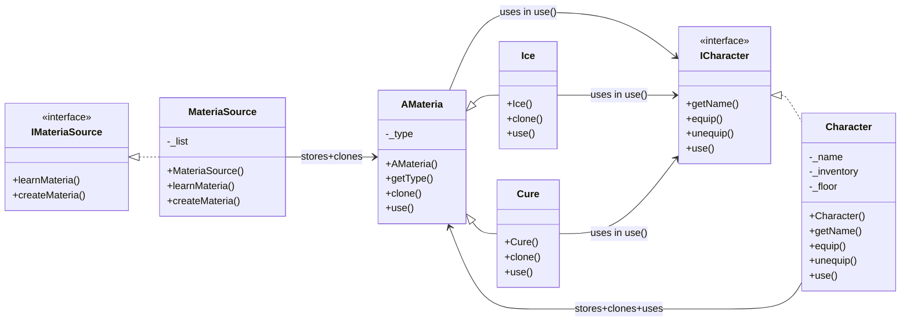

# 42-CPP_Module_04
42 Common Core CPP Module 02.  
- Polymorphism
- Abstract classes
- Interfaces
- Memory management
 
## Table of Contents
- [Polymorphism and Deep Copy](polymorphism-and-deep-copy)
- [Abstract Classes](#abstract-classes)
- [Interfaces](#interfaces)
- [Abstract Classes vs Interfaces](#abstract-classes-vs-interfaces)
- [Ownership](#ownership)
- [Dependencies](#dependencies)
  - [ex03: Classes and Dependencies](#ex03:-classes-and-dependencies)
  - [Dependency Diagram](dependency-diagram)
- [More things](#more-things)
  - [Some Good Practices](#some-good-practices)
  - [About std::vector](#about-std::vector)

----------------------------------------

## Polymorphism and Deep copy
Polymorphism lets us work with objects through base-class pointers/references while calling the correct derived implementation at runtime.  
This requires careful resource management when objects own dynamically allocated memory.

- Sallow copy: only the pointer is copied -> two objects share the same resource -> leads to double-delete errors.
- Deep copy: creates a *new* independent resource -> each object owns its own memory.

**Example: deep copy in constructor**:

           this->brain = new Brain(*other._brain)

**Example: deep copy in assignment operator**:
    
	Cat& Cat::operator=(const Cat& other)
	{
		if (this != &other)
		{
			Animal::operator=(other); //copy base part
			delete this->_brain; //prevent memory leak
			*this->_brain = *other._brain; //deep copy
		}
		return (*this);
	} 

**Example: deep copy for inventory**:
  
	Character& Character::operator=(const Character& other)
	{
		if (this != &other)
		{
			this->_name = other._name;
			for (int i = 0; i < 4; i++)
			{
				delete this->_inventory[i ];
				this->_inventory[i] = other._inventory[i]->clone();
			}
		}
		return *this;
	}

## Abstract Classes

An Abstract class is a base class that cannot be instantiated directly.
- The act as **base contracts** for derived classes.
- They must have at least one **pure virtual function (=0)**.
- They can also have:
  - Concrete (non-virtual) methods
  - Attributes and constructors
  - Destructors (should be virtual if polymorphic for proper cleanup)

**Example**:

	class Animal
	{
		public:
			virtual Brain &getBrain() const = 0; //pure virtual method
	}

**Derived implementation**:

	Brain& Dog::getBrain() const
	{
		return *this->_brain;
	}

Sometimes abstract classes have **protected constructors** to prevent instantiation, even without pure virtual methods.

**What means you cannot instantiate a class?**
You cannot:

	Animal a;
	a = new Animal;
	
You can:

	Animal* pets[10];
	pets[i] = new Dog();

And also:

	void makeSpeak(Animal& a)
	{
		//Polymorphic call
	}

	Dog d;
	makeSpeak(d);

## Interfaces

An interface is a pure abstract class:
- All methods are pure virtual (=0)
- No instance attributes (except constants)
- Acts as a contract only
Features:
- Cannot be instantiated
- Can be used as pointers/references to enable polymorphism
- Supports multiple inheritance

The interfaces are used when you want to define a behaviour common to several very different classes.  
For example: an interface IPrintable could be implemented by unrelated classes like Invoice, Report, or Label.

### Abstract Classes vs Interfaces

| **Abstract Classes**  | **Interfaces** | 
|-----------------------|----------------|
| At least one pure virtual method | 100% pure virtual methods |
| Can contain logic, attributes, constructors | No attributes (except constants/static) |
| Used when there's a hierarchical relation | Used when classes share behaviour but not hierarchy |

## Ownership

**Ownership** defines which class is responsible for freeing memory.

	class Materia 
	{
		public:
		    virtual ~Materia() {}
	};
	
	class Character 
	{
			Materia* _inventory[4];
		public:
		    Character() 
		    { 
		    	for (int i = 0; i < 4; i++) 
				_inventory[i] = NULL; 
		    }
		    ~Character() 
		    {
		    	for (int i = 0; i < 4; i++)
			delete _inventory[i]; // Frees the *Materia
		    }
		    void equip(Materia* m) //receives de Materia*
		    {
	        		for (int i = 0; i < 4; i++) 
			{
	            		if (!_inventory[i]) 
				{
	                			_inventory[i] = m; //stores the *Materia
	                		break;
	            		}
			}
		}
	};

- Character receives a Materia*
- The Character stores that pointer and owns it
- When the Character dies, frees the memory of all the pointers of the inventory

## Dependencies

A **dependency** means a class uses another class's functionallity.
Circular dependencies occur when two classes depends on each other.

Example in ex03: 
- ICharacter.hpp included AMateria.hpp
- AMateria.hpp also includes ICharacter.hpp
Solution:
- Use **forward declarations** when only pointers/references are needed
- Use #include only if you need the full definition 

### ex03: Classes and Dependencies
- AMateria:
  - Abstract base class (clone(): virtual pure)
  - Derived classes: Ice y Cure
  - Depends on:
    - ICharacter (in use(ICharacter& target))
- Ice / Cure:
  - Concrete classes inheriting from AMateria
  - Implement clone() and override use()
- ICharacter:
  - Interface for characters
  - Declares pure virtual methods: getName(), equip(), unequip(), use()
  - Doesn't have direct dependencies, but defines the interaction with AMateria
- Character:
  - Implements ICharacter
  - Owns:
    - _inventory[4]: pointers to AMateria
    - _floor: vector of pointers to AMateria*
  - Dependencies:
    - AMateria (pointers and clonation)
    - ICharacter
- IMateriaSource
  - Interface for MateriaSource
  - Declares virtual pure methods: learnMateria(), createMateria()
  - Doesn't have direct dependencies, but defines the interaction with AMateria
- MateriaSource
  - Implements IMateriaSource
  - Owns:
    - _list[4]: pointers to AMateria
  - Dependencies:
    - AMateria (pointers and clonation)
    - IMateriaSource

### Dependency Diagram

## More things

## Some Good Practices
- Use references in function/method parameters to avoid unnecessary copies
- Use const whenever possible to signal immutability and enforce safer code
- Always declare destructors as ***virtual*** in base classes meant for polymorphism, so that deleting through a base pointer correctly calls the derived destructor

## About std::vector
std::vector is a dynamic array in the C++ Standard Template Library.
- Stores elements in continuos memory
- Automatically resizes
- Provides random access like a normal array

**Some methods (C++98)**:  
- push_back(value): add at the end
- size(): number of elements
- empty(): true if vector is empty
- operator[index]: unchecked access
- at(index): checked access
- front(): first element
- back(): last element
- pop_back(): remove last element
- clear(): remove all elements
- erase(iterator): remove eleent at position
- begin(): first element
- end(): after the last element (end of range)

Example:

	#include <vector>
	#include <iostream>
            
	int main()
	{
		std::vector<int> numbers;
	
		numbers.push_back(10); //adds at the end
		numbers.push_back(20);
		numbers.push_back(30);
	
		std::cout << "Size: " << numbers.size() << std::endl; //3
		std::cout << "First element: " << numbers[0] << std::endl; //10
	
		//iteration
		for (std::vector<int>::iterator it = numbers.begin(); it != numbers.end(); ++it)
			std::cout << *it << std::endl;
		
	}

