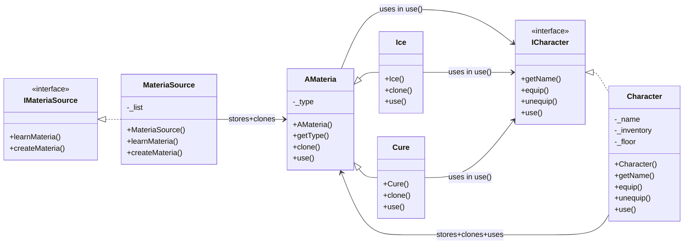

# 42-CPP_Module_04
42 Common Core CPP Module 02.  
- Polymorphism
- Abstract classes
- Interfaces
- Memory management
 
## Table of Contents
- [Polymorphism](#polymorphism)
  - [Dynamic Polymorphism](#dynamic-polymorphism)
  - [Shallow Copy vs Deep Copy](#shallow-copy-vs-deep-copy)
- [Abstract Classes](#abstract-classes)
- [Interfaces](#interfaces)
- [Abstract Classes vs Interfaces](#abstract-classes-vs-interfaces)
- [Ownership](#ownership)
- [Dependencies](#dependencies)
  - [ex03: Classes and Dependencies](#ex03-classes-and-dependencies)
  - [Dependency Diagram](dependency-diagram)
- [More things](#more-things)
  - [Good Practices](#good-practices)
  - [About std::vector](#about-stdvector)

----------------------------------------

## Polymorphism
Polymorphism is a core concept of object-oriented programming that allows a single interface (such as function or pointer to a base clase) to behave differently depending on the actual derived type of the object at runtime.  
There are two main types of polymorphism in C++:
- Compile-time (static) polymorphism:
  - Achieved through function overloading, operator overloading, and templates.
  - Resolved at compile time.
- Runtime (dynamic) polymorphism:
  - Achieved using inheritance and virtual functions.
  - Resolved at runtime.

### Dynamic Polymorphism
Dynamic polymorphism works when the following conditions are met:
- Inheritance: a derived class inherits from a base class
- Virtual functions: the base class defines at least one virtual function, which can be overriden by the derived class.
- Base class pointers or references: Acces to the derived objects is done through base cass pointers or references.
This allows behaviour to be dunamically dispatched depending on the actual type of the objects during execution.

### Shallow copy vs Deep copy
When using dynamic polymoprhism, we often manipulate objects through pointers or references to base classes. This introduces complexity in memory management, especially when derived classes allocate resources on the heap.

- Shallow copy:
  - Only the pointer is copied, not the resource it points to.
  - Two objects share the same resource.
  - lThis eads to double-delete, dangling pointers, or unexpected side effects.
- Deep copy:
  - A new, independent copy of the resource is created.
  - Each object owns its own memory.
  - Prevents memory errors and ensures safer object duplication.

**Example: deep copy in constructor**:

		Cat::cat(const Cat& other) : Animal(other)
		{
			this->brain = new Brain(*other._brain);
		}

**Example: deep copy in assignment operator**:
    
	Cat& Cat::operator=(const Cat& other) : 
	{
		if (this != &other)
		{
			Animal::operator=(other); //copy base part
			delete this->_brain; //prevent memory leak
			*this->_brain = new Brain(*other._brain); //deep copy
		}
		return *this;
	} 

**Example: deep copy for inventory (use of clone() to copy derived objects)**:
  
	Character& Character::operator=(const Character& other)
	{
		if (this != &other)
		{
			this->_name = other._name;
			for (int i = 0; i < 4; i++)
			{
				delete this->_inventory[i ]; //free current memory
				this->_inventory[i] = other._inventory[i]->clone(); //deep copy
			}
		}
		return *this;
	}

## Abstract Classes

An Abstract class is a base class that cannot be instantiated directly.
- Acts as **base contracts** for derived classes.
- Contains at least one **pure virtual function (=0)**.
- Can also have:
  - Concrete (non-virtual) methods
  - Attributes
  - Constructors
  - Destructors (should be virtual if polymorphic for proper cleanup)

**Example**:

	class Animal
	{
		public:
			virtual ~Animal {}
			virtual Brain &getBrain() const = 0; //pure virtual method
	};

**Derived implementation**:

	Brain& Dog::getBrain() const
	{
		return *this->_brain;
	}

Sometimes abstract classes have **protected constructors** to prevent instantiation, even without pure virtual methods.

You cannot do this:

	Animal a;
	Animal *a = new Animal;
	
But you can do this:

	Animal* pets[10];
	pets[i] = new Dog();

And also:

	void makeSpeak(Animal& a)
	{
		a.speak(); //polymorphic call
	}

	Dog d;
	makeSpeak(d);

## Interfaces

In C++, an interface is implemented as a pure abstract class:
- All methods are pure virtual (=0)
- No instance attributes (except constants)
- Acts as a contract only
Features:
- Cannot be instantiated
- Can be used as pointers/references to enable polymorphism
- Supports multiple inheritance to compose behaviors.

Interfaces are used when you want to define a **common behavior** across unrelated classes.  
For example: an interface IPrintable could be implemented by unrelated classes like Invoice, Report, or Label.

### Abstract Classes vs Interfaces

| **Abstract Classes**  | **Interfaces** | 
|-----------------------|----------------|
| At least one pure virtual method | 100% pure virtual methods |
| Can contain logic, attributes, constructors | No attributes (except constants/static) |
| Used when there's a hierarchical relation | Used when classes share behaviour but not hierarchy |

## Ownership

**Ownership** refers to which class is responsible for deallocating memory.

	class Materia 
	{
		public:
		    virtual ~Materia() {}
	};
	
	class Character 
	{
			Materia* _inventory[4];
		public:
		    Character() 
		    { 
		    	for (int i = 0; i < 4; i++) 
				_inventory[i] = NULL; 
		    }
		    ~Character() 
		    {
		    	for (int i = 0; i < 4; i++)
			delete _inventory[i]; // Frees pointer
		    }
		    void equip(Materia* m) //receives Materia*
		    {
	        		for (int i = 0; i < 4; i++) 
			{
	            		if (!_inventory[i]) 
				{
	                			_inventory[i] = m; //store pointer
	                		break;
	            		}
			}
		}
	};

Explanation:  
- Character receives a pointer to Materia object
- The Character stores the pointer, becoming the owner
- When the Character is destroyed, it deletes the memory of all the pointers of the inventory

## Dependencies

A **dependency** exists when a class relies on another for functionallity.
A **circular dependency** occurs when two classes depend on each other, cauusing compilation issues.

Example in ex03: 
- ICharacter.hpp includes AMateria.hpp
- AMateria.hpp includes ICharacter.hpp
Solution:
- Use **forward declarations** (e.g., class ICharacter;) when only pointers/references are needed
- Use **#include** only if you need the full definition 

### ex03: Classes and Dependencies
- AMateria:
  - Abstract base class (clone(): virtual pure)
  - Derived classes: Ice y Cure
  - Dependencies:
    - ICharacter (in use(ICharacter& target))
- Ice / Cure:
  - Concrete classes inheriting from AMateria
  - Implement clone() and override use()
- ICharacter:
  - Interface for characters
  - Declares pure virtual methods: getName(), equip(), unequip(), use()
  - Doesn't have direct dependencies, but defines the interaction with AMateria
- Character:
  - Implements ICharacter
  - Owns:
    - _inventory[4]: pointers to AMateria
    - _floor: vector of pointers to AMateria*
  - Dependencies:
    - AMateria (pointers and clonation)
    - ICharacter
- IMateriaSource
  - Interface for MateriaSource
  - Declares virtual pure methods: learnMateria(), createMateria()
  - Doesn't have direct dependencies, but defines the interaction with AMateria
- MateriaSource
  - Implements IMateriaSource
  - Owns:
    - _list[4]: pointers to AMateria
  - Dependencies:
    - AMateria (pointers and clonation)
    - IMateriaSource

### Dependency Diagram

## More things

## Some Good Practices
- Use references in function/method parameters to avoid unnecessary copies
- Use const whenever possible to signal immutability and enforce safer code
- Always declare destructors as ***virtual*** in base classes meant for polymorphism, so that deleting through a base pointer correctly calls the derived destructor

## About std::vector
std::vector is a dynamic array in the C++ Standard Template Library.
- Stores elements in continuous memory
- Automatically resizes
- Provides random access like a normal array

**Common methods (C++98)**:  
- push_back(value): add at the end
- size(): number of elements
- empty(): true if vector is empty
- operator[index]: unchecked access
- at(index): checked access
- front(): first element
- back(): last element
- pop_back(): remove last element
- clear(): remove all elements
- erase(iterator): remove element at position
- begin(): first element
- end(): after the last element (end of range)

Example:

	#include <vector>
	#include <iostream>
            
	int main()
	{
		std::vector<int> numbers;
	
		numbers.push_back(10); //adds at the end
		numbers.push_back(20);
		numbers.push_back(30);
	
		std::cout << "Size: " << numbers.size() << std::endl; //3
		std::cout << "First element: " << numbers[0] << std::endl; //10
	
		//iteration
		for (std::vector<int>::iterator it = numbers.begin(); it != numbers.end(); ++it)
			std::cout << *it << std::endl;
		
	}

